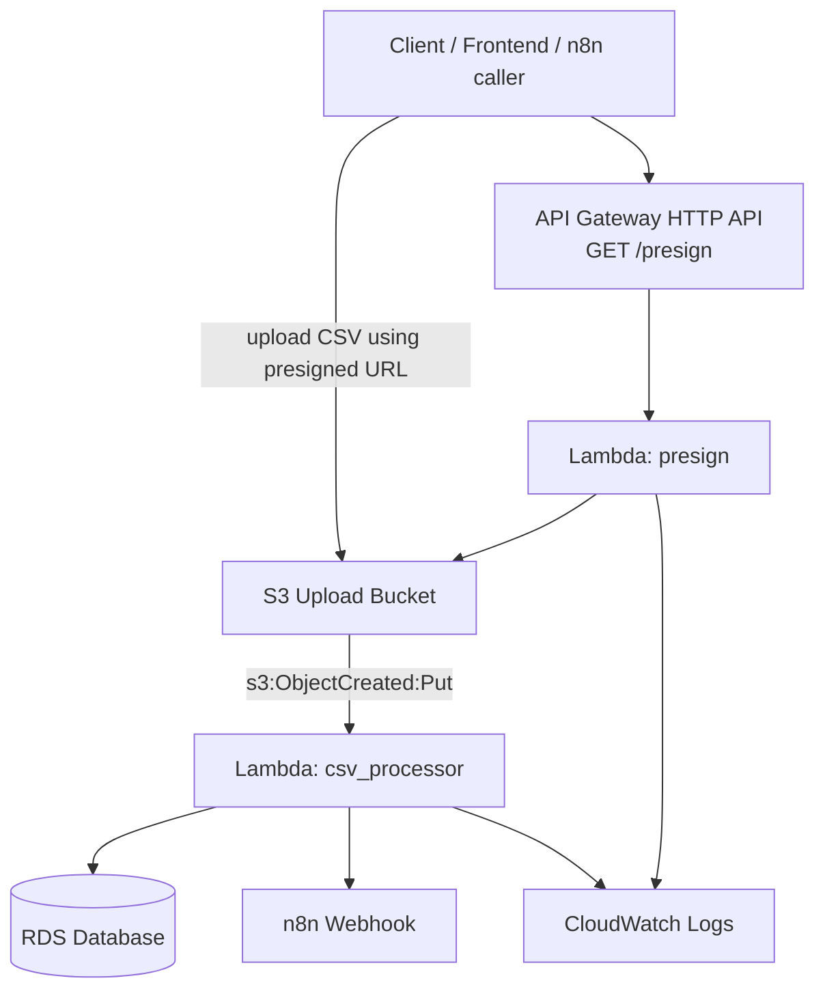

# Terraform Version of Your Serverless Template

This folder contains a Terraform version of the Serverless setup you shared.

If you are new to Terraform, the biggest idea is this:

- You describe the infrastructure you want in `.tf` files.
- Terraform compares that desired state with what already exists in AWS.
- Then Terraform creates, updates, or deletes resources to match.

In this project, Terraform will create AWS resources for your Lambda-based CSV workflow.

## What this infrastructure does

This setup supports two main flows:

1. A client calls `GET /presign`
2. API Gateway forwards that request to the `presign` Lambda
3. The `presign` Lambda returns a presigned S3 upload URL
4. The client uploads a CSV file to S3 using that URL
5. S3 triggers the `csv_processor` Lambda
6. The `csv_processor` Lambda reads the file and continues your processing logic

## What resources Terraform creates

- One S3 bucket for file uploads
- One Lambda named for the presign endpoint
- One Lambda named for CSV processing
- One API Gateway HTTP API
- One API route: `GET /presign`
- One S3 event notification for new uploads
- One IAM role for both Lambdas
- IAM permissions for CloudWatch logs and S3 access
- Two CloudWatch log groups, one for each Lambda

## How this maps from your Serverless file

- `functions.presign` in Serverless becomes `aws_lambda_function.presign`
- `functions.csvProcessor` in Serverless becomes `aws_lambda_function.csv_processor`
- `events.httpApi` becomes the API Gateway resources in `api.tf`
- `resources.UserUploadsBucket` becomes `aws_s3_bucket.uploads`
- S3 invoke permission becomes `aws_lambda_permission.allow_s3_csv_processor`

## How to read this project

Read the files in this order:

1. `variables.tf`
   This is where you see the inputs for the project, like bucket name, region, zip file paths, and database settings.

2. `main.tf`
   This is the overview file. It defines shared names, shared environment variables, and shared tags.

3. `lambda.tf`
   This creates the two Lambda functions and their CloudWatch log groups.

4. `api.tf`
   This exposes `GET /presign` publicly through API Gateway.

5. `s3.tf`
   This creates the upload bucket and tells S3 to trigger the CSV Lambda after upload.

6. `iam.tf`
   This defines what your Lambdas are allowed to do in AWS.

7. `outputs.tf`
   This prints useful values after deployment, like the API endpoint and bucket name.

## Beginner explanation of the key Terraform concepts

### 1. `variable`

A variable is an input to your Terraform project.

Example:

- AWS region
- S3 bucket name
- path to a Lambda zip file

You define variables in `variables.tf`, then set real values in `terraform.tfvars`.

### 2. `resource`

A resource is a real thing Terraform creates in AWS.

Examples in this project:

- `aws_lambda_function`
- `aws_s3_bucket`
- `aws_apigatewayv2_api`
- `aws_iam_role`

If you remember only one thing, remember this:
most of Terraform is just declaring resources.

### 3. `locals`

Locals are helper values used only inside Terraform.

They are useful when:

- a value is reused many times
- you want cleaner naming
- you want to avoid copying the same map or string everywhere

### 4. `depends_on`

Terraform usually figures out dependency order automatically.
Sometimes we keep `depends_on` to make the order clearer and safer.

Example in this project:

- create IAM permissions first
- create the log group
- then create the Lambda

### 5. `output`

Outputs are values Terraform prints after deployment.

Examples:

- API URL
- S3 bucket name
- Lambda names

## Files in this folder

- `providers.tf`: tells Terraform which AWS provider plugin to use
- `variables.tf`: all project inputs
- `main.tf`: overview and shared locals
- `iam.tf`: Lambda role and policies
- `lambda.tf`: both Lambda functions and log groups
- `api.tf`: API Gateway resources for `GET /presign`
- `s3.tf`: upload bucket and S3 trigger
- `outputs.tf`: values shown after apply
- `terraform.tfvars.example`: sample values to copy and edit

## Before you deploy

### 1. Install Terraform

Terraform is not included automatically. You need it installed locally.

### 2. Package your Python Lambdas

Terraform does not do the same packaging work that Serverless plugins do.
That means these files must already exist before deploy:

- `presign_zip_path`
- `csv_processor_zip_path`

### 3. Copy the example variable file

```bash
cp terraform.tfvars.example terraform.tfvars
```

### 4. Edit `terraform.tfvars`

At minimum, set:

- `aws_region`
- `s3_bucket_name`
- `presign_zip_path`
- `csv_processor_zip_path`
- `n8n_webhook_base_url`
- `n8n_webhook_key`
- `rds_host`
- `rds_port`
- `rds_db`
- `rds_user`
- `rds_password`

## Deploy commands

### `terraform init`

Downloads the AWS provider plugin and prepares the folder.

### `terraform plan`

Shows what Terraform wants to create, change, or destroy.
This is your safety check before applying.

### `terraform apply`

Actually creates the resources in AWS.

Run them in order:

```bash
terraform init
terraform plan
terraform apply
```

## Important beginner warnings

- S3 bucket names must be globally unique across all AWS accounts
- Terraform state may contain sensitive values, even when variables are marked `sensitive`
- If the zip path is wrong, Lambda creation will fail
- If IAM permissions are missing, Lambda may deploy but fail at runtime
- If you later rename resources carelessly, Terraform may try to replace them

## Suggested next improvements later

- move secrets to AWS Secrets Manager or SSM Parameter Store
- store Terraform state remotely in S3
- add separate `dev.tfvars` and `prod.tfvars`
- add more specific IAM permissions if your app needs least-privilege security
- add a packaging script so your Python Lambdas can be zipped consistently

## Architecture Diagram

### Plain-English view

- The client calls the HTTP endpoint
- API Gateway invokes the `presign` Lambda
- The `presign` Lambda returns a presigned URL for S3
- The client uploads the CSV file into S3
- S3 triggers the `csv_processor` Lambda
- The `csv_processor` Lambda uses the database and webhook settings from environment variables
- Both Lambdas write logs to CloudWatch

### Mermaid diagram



### ASCII diagram

```text
Client
  |
  v
API Gateway (GET /presign)
  |
  v
Lambda: presign
  |
  | returns presigned upload URL
  v
Client uploads CSV to S3 bucket
  |
  v
S3 Upload Bucket
  |
  | s3:ObjectCreated:Put
  v
Lambda: csv_processor
  | \
  |  \--> CloudWatch Logs
  |
  +----> RDS Database
  |
  +----> n8n Webhook

Lambda: presign
  |
  +----> CloudWatch Logs
```
